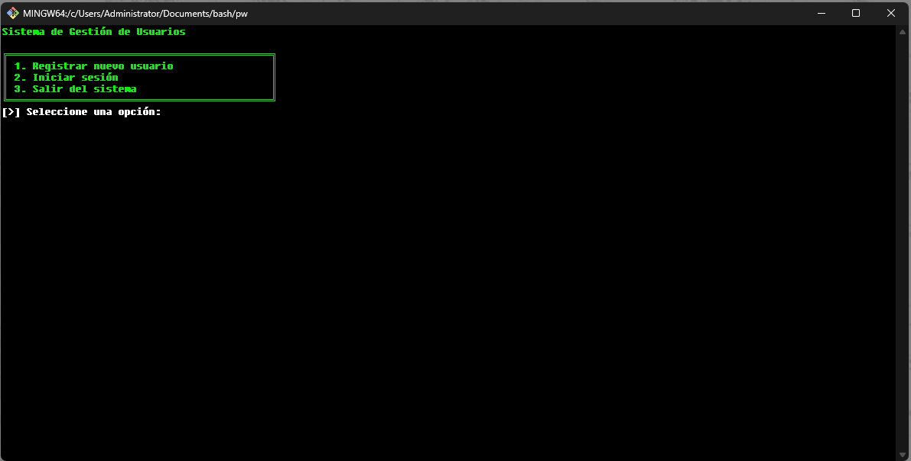
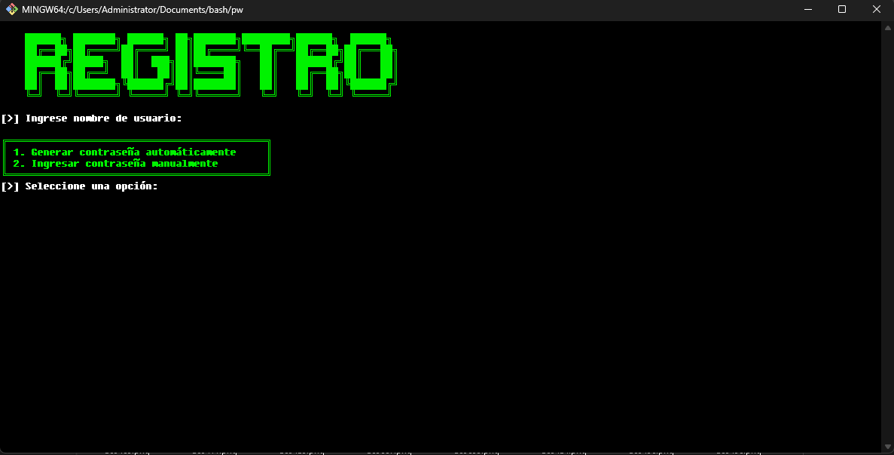
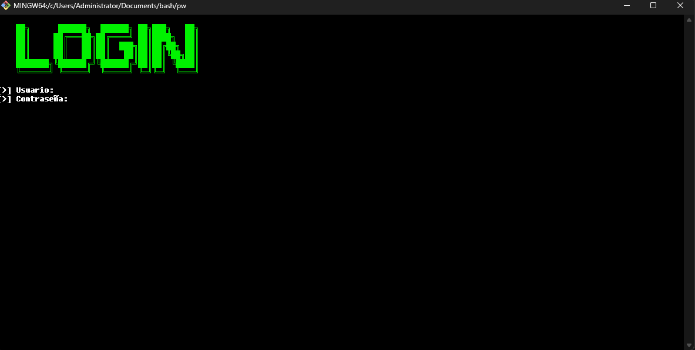

# **Sistema de Gestión de Usuarios y encriptación**

Este es un sistema de gestión de usuarios en línea de comandos (CLI) que permite a los usuarios registrar nuevos usuarios, iniciar sesión y gestionar contraseñas con reglas de seguridad.

## Funcionalidades

### 1. **Registrar nuevo usuario**
   - El sistema permite registrar un nuevo usuario con una contraseña segura.
   - Al registrar un usuario, se puede elegir entre:
     - **Generar una contraseña automáticamente**: Se genera una contraseña aleatoria de 12 caracteres que cumple con los siguientes requisitos:
       - Al menos una letra mayúscula (A-Z)
       - Al menos una letra minúscula (a-z)
       - Al menos un número (0-9)
       - Al menos un carácter especial de los siguientes: `@`, `#`, `$`, `%`, `&`, `*`
     - **Ingresar una contraseña manualmente**: El usuario puede proporcionar su propia contraseña, que será validada con las reglas anteriores. Si la contraseña no cumple con los requisitos, se pedirá que el usuario la ingrese nuevamente.

### 2. **Iniciar sesión**
   - El sistema permite a los usuarios iniciar sesión proporcionando su nombre de usuario y contraseña.
   - Si las credenciales son correctas (es decir, si coinciden con un registro en el archivo `users.txt`), el acceso es concedido.
   - Si las credenciales no coinciden, se mostrará un mensaje de error.

### 3. **Salir del sistema**
   - El sistema permite cerrar la aplicación y salir del programa.

## Validación de Contraseña
Las contraseñas deben cumplir con los siguientes requisitos:
- Longitud mínima de 12 caracteres.
- Deben incluir al menos:
  - Una letra mayúscula (A-Z).
  - Una letra minúscula (a-z).
  - Un número (0-9).
  - Un carácter especial de los siguientes: `@`, `#`, `$`, `%`, `&`, `*`.

Si la contraseña no cumple con alguna de estas reglas, el sistema mostrará un mensaje de error y pedirá al usuario que intente de nuevo.

## Uso de Colores
El sistema usa colores para mejorar la visibilidad:
- **Verde**: Mensajes de éxito y resultados positivos.
- **Rojo**: Mensajes de error y advertencias.
- **Blanco**: Mensajes informativos.
- **Gris**: Mensajes neutrales.

## Estructura del Archivo
Los usuarios se almacenan en un archivo llamado `users.txt`, donde cada línea contiene el nombre de usuario y la contraseña, separados por dos puntos (`:`).

## Requisitos
- El sistema está diseñado para ejecutarse en un entorno de terminal de Linux o macOS.
- Necesitas permisos para leer y escribir en el archivo `users.txt`.

## Ejemplo de Uso

1. **Registrar usuario**:
   - Se genera una contraseña automáticamente o se ingresa manualmente.
   - El nombre de usuario y la contraseña se guardan en `users.txt`.

2. **Iniciar sesión**:
   - Se proporciona el nombre de usuario y la contraseña.
   - Si coinciden con los datos almacenados en `users.txt`, se concede acceso.

